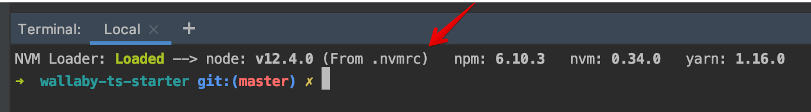

# Shell Welcome Quote :: Data Contracts

Data Contracts - is set of interfaces to be used on both sides API & UI.

## Technical Features

* Wallaby JS works out of the box without any additional config  
  Notice: How to run in "Without Configuration" mode ([Official Wallaby JS Guide](https://wallabyjs.com/docs/intro/config.html#automatic-configuration))
* [ESLint](https://eslint.org) for linting JS & TS files ([TSLint is deprecated in 2019](https://github.com/palantir/tslint#tslint)). Basic rules configured.
* Very strict linting [config](/src/.eslintrc.js) ([airbnb](https://www.npmjs.com/package/eslint-config-airbnb-base) + [unicorn](https://www.npmjs.com/package/eslint-plugin-unicorn) + [some other plugins](/src/.eslintrc.js#L11))
* Unit Testing via [Jest](https://jestjs.io/) 24+
* Additional Jest matchers from [`jest-extended`](https://github.com/jest-community/jest-extended) configured
* [TypeScript](http://typescriptlang.org/) 3.7+ via [Babel](https://babeljs.io/docs/en/babel-preset-typescript)
* Yarn for packages installation and [`check-yarn`](/tools/check-yarn.js) utility to prevent packages installation via `npm`
* [`.nvmrc`](https://github.com/nvm-sh/nvm#nvmrc)
* Nothing platform related. This repository template can be used for NodeJS and for Browser development.
* Git hooks via [husky](https://www.npmjs.com/package/husky)
* [Utility](/tools/merge-with-repository-template.sh) to automatically pull updates from the template repository (`npm run tpl-repo:merge`)

## Quick Start

1. Clone as is

    1. `git clone git@github.com:Shell-Welcome-Quote/swq-data-contracts.git`
    2. `cd wallaby-ts-starter`
    3. `yarn`

## How to

### How to use NodeJS version from the `.nvmrc`

1. Install NVM
2. Use `.nvmrc` file one of the next ways:

    * Execute `nvm use` in the project root directory
    * Install [NVM Loader](https://github.com/korniychuk/ankor-shell) and your .nvmrc will be loaded automatically when you open the terminal.
      

### How to make a build

`npm run build`

### How to run lint

* Just show problems `npm run lint`
* Fix problems if it is possible `npm run lint:fix`

### How to run tests

* All tests

  `npm run test`  
  `npm run test:watch`
* Specific tests

  `npm run test -- src/my.spec.ts`  
  `npm run test:watch -- src/my.spec.ts`

## Author

| [ Anton Korniychuk](https://korniychuk.pro) |
| :---: |
